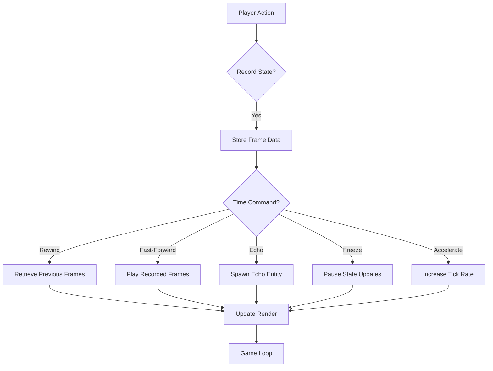
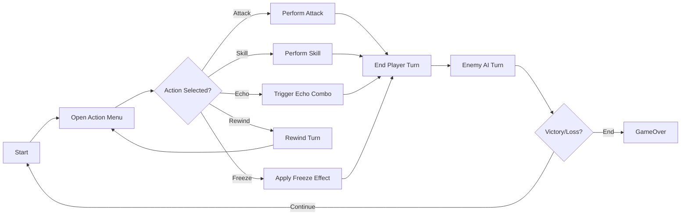

# Chronic Echos Checklists & Flowcharts

## Development Phases Checklist

- [x] Phase 1: Engine Core (build pipeline, PPU init, tilemap rendering, input) - Basic title screen working
- [ ] Phase 2: Time Manipulation System (record, rewind, echoes, freeze, accelerate)
- [ ] Phase 3: Overworld & Puzzles (era maps, CHR bank swaps, interactive puzzles)
- [ ] Phase 4: Combat System (turn queue, menu, actions, echo combos)
- [ ] Phase 5: Narrative & Dialogue (text engine, branching quests, memory persistence)
- [ ] Phase 6: Audio & UI (SPC integration, HUD, save/load SRAM)
- [ ] Phase 7: Polish & Testing (balance, performance, docs, packaging)

## Feature Implementation Checklist

- [ ] Preview Time (display future glimpse overlay)
- [ ] Time Travel (load past, present, future environments)
- [ ] Time Echo (spawn recorded clone entity)
- [ ] Time Rewind (undo battle turn or frame)
- [ ] Time Freeze (pause world logic)
- [ ] Time Acceleration (speed world tick rate)
- [ ] Paradox Detection (flag conflicting changes)
- [ ] Memory System (persist cross-era choices)

## Time Manipulation Flowchart

## Combat Turn Flowchart

